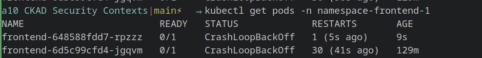

****

## Sichere deinen Container ab, dass sie nicht als Root user laufen und man auch nicht nachträglich Root werden kann.

I've edited the dockerfile to add a new user with the userid 1500 and added `securityContext:` `runAsUser: 1500` to my deployment yaml file.

[ckad-security-context-dockerfile](docs/Praktische%20Projekte/auftraege/CKAD/aufgaben/a10%20CKAD%20Security%20Contexts/ckad-security-context-dockerfile)

[a10 CKAD Sec context-frontend](docs/Praktische%20Projekte/auftraege/CKAD/aufgaben/a10%20CKAD%20Security%20Contexts/a10%20CKAD%20Sec%20context-frontend.yml)

>[!error] Result
>
>
>
>*Containers seem to crash*
>
>
>
>Cause seems to be a **Permission denied** error (no longer root).
>
>Problem is that the gb-frontend google image wants to listen on port 80 which is a priveleged port. Therefore root access is required.
>A possible solution would be to edit the config files of apache via a [config map](docs/CKAD/A3%20Configuration/config%20maps%20(CKAD).md). By changing to a port higher than 1000 it could work without root accesss.

## Verhindere, dass in deinen Container System Capabilities verwendet werden können:

Im [a10 CKAD Sec context-frontend](docs/Praktische%20Projekte/auftraege/CKAD/aufgaben/a10%20CKAD%20Security%20Contexts/a10%20CKAD%20Sec%20context-frontend.yml) file wurde unter `securityContext:` das felt `capabilities:` `drop:` hinzufgefügt und `- All` wurde ausgewählt.

Daraufhin crasht der Pod weil er keine rechte hat:

